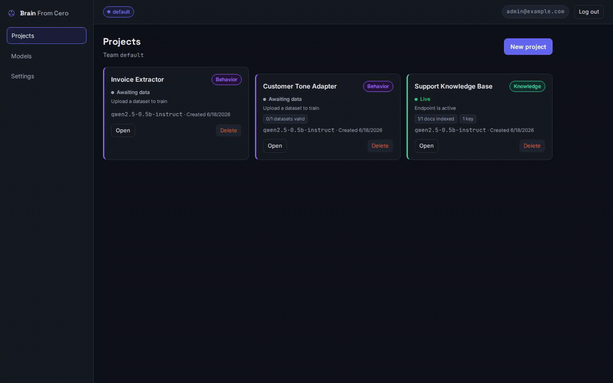
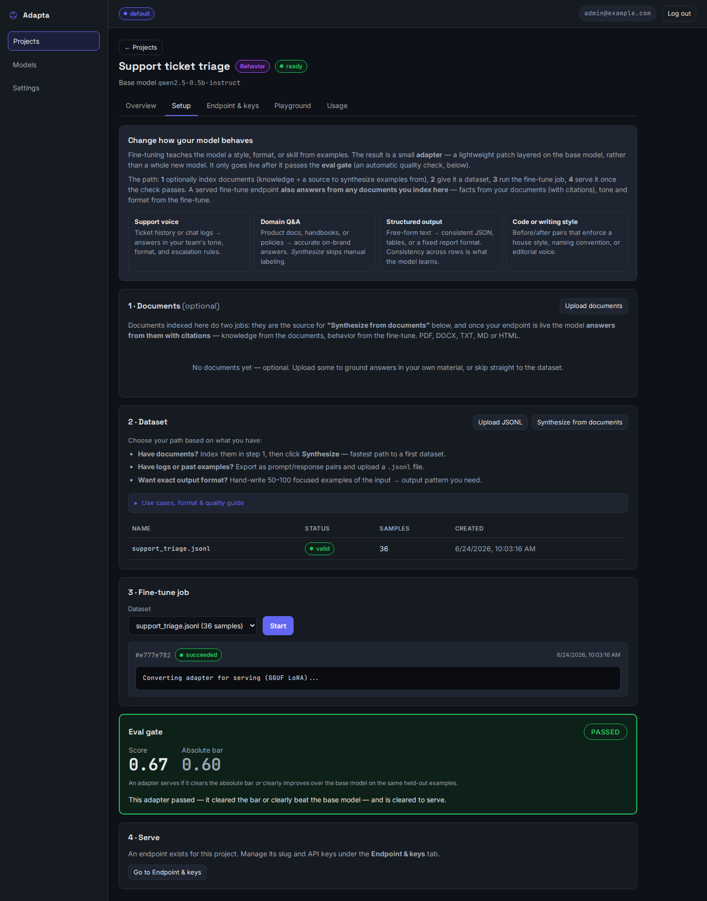
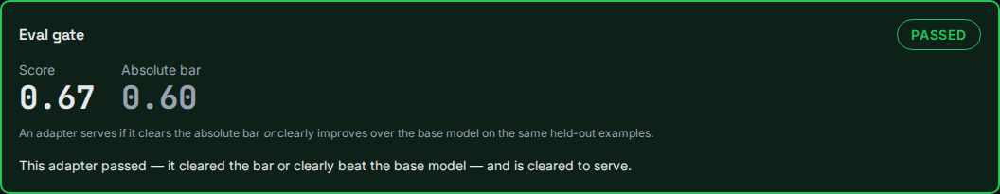
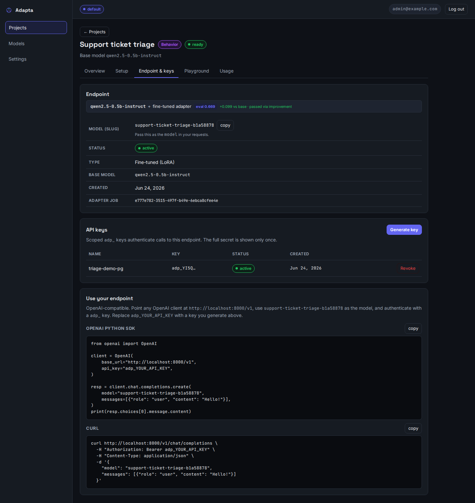
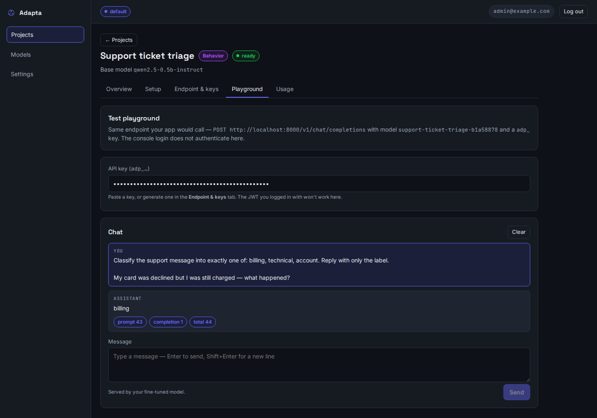

<div align="center">

# 

### Your model. Your data. Your servers.

**Adapta is a self-hosted platform for customizing and serving private language models.**
Give a model your **knowledge** (cited retrieval) and your **behavior** (a trained adapter),
and serve both behind a single **OpenAI-compatible** endpoint — on hardware you control.

[](https://github.com/yielab/adapta/actions/workflows/ci.yml)
[](LICENSE)
[](https://www.python.org/downloads/release/python-3110/)
[](docker-compose.yml)
[](#using-the-api)
[](#-documentation)

[**Documentation**](#-documentation) · [**Quick start**](#-quick-start-5-minutes-cpu) · [**Using the API**](#using-the-api) · [**Image understanding**](#️-image-understanding-ocr--visual-extraction) · [**How it works**](#how-it-works) · [**Roadmap**](TODO.md)



</div>

---

## What is Adapta?

Adapta runs **on-premise**. A team deploys it on their own server, creates **Projects**, and each
project becomes a private model endpoint consumed with a scoped API key. **No data ever leaves your
infrastructure** — there is no telemetry and no callback to any external service.

It answers two needs that have no good *private* solution today:

- 📚 **Give it knowledge (RAG)** — answer from *your* documents, with citations. Retrieval is
  **hybrid**: semantic vector search *and* BM25 keyword search, fused and re-scored by a
  cross-encoder reranker, so exact terms (product codes, names) survive alongside meaning. The
  model's weights never change. **CPU-only.**
- 🎛️ **Change how it behaves (fine-tuning / LoRA)** — train an adapter on *your* data; it only goes live after passing an automatic **eval gate**. **Needs a GPU.**
- 👁️ **Teach it to read images (vision fine-tuning)** — train on image+text examples so it extracts fields from invoices, receipts, forms or screenshots into structured **JSON** — OCR that understands *your* layout, served through the same endpoint. **Needs a GPU.**

And knowledge and behavior **compose on a single endpoint**: facts retrieved from your documents
(cited) *and* the tone/format of your fine-tune, in the same call.

No confirmed competitor combines all of these in one self-hosted product. vLLM and LoRAX serve
adapters at scale but cannot train or do RAG. H2O LLM Studio trains LoRA/QLoRA (including DPO) but
has no serving or RAG. AnythingLLM does RAG but cannot fine-tune. NVIDIA NeMo covers most of the
surface but requires Kubernetes and 10+ microservices. See the
[competitive landscape](docs/reference/COMPETITIVE_LANDSCAPE.md) for the full comparison matrix with
citations.

> [!IMPORTANT]
> **Status: working prototype — a one-person, AI-assisted (Claude) project.** The full lifecycle
> works end-to-end (RAG, LoRA training, eval gate, multi-tenant serving, image-understanding
> fine-tunes), but it is **not production-hardened**: GPU test coverage is partial, and the auth and
> eval-gate paths should be reviewed independently before being trusted with sensitive data.
> MIT-licensed and built for private-team use — if you deploy it, expect to audit and harden it yourself.

---

## 📖 Documentation

Full documentation is a **MkDocs Material** site built from [`docs/`](docs/) and published to GitHub
Pages (`mkdocs build --strict` runs in CI, so internal links never rot). Once the stack is running,
interactive API docs are live at **`/docs`**.

| Audience | Start here |
| --- | --- |
| **Using the console / API** | [User Guide](docs/user-guide/index.md) — console walkthrough, consuming the API, [knowledge + behavior together](docs/user-guide/knowledge-and-behavior.md) |
| **Building on / contributing** | [Developer Guide](docs/developer-guide/index.md) — architecture, contract-driven workflow, and [Learning the system](docs/developer-guide/learning-the-system.md) (RAG, embeddings, LoRA, GGUF and the eval gate, explained with backend analogies) |
| **Operating it** | [Operations](docs/reference/OPERATIONS.md) — backup/restore, upgrades, VRAM sizing, hardening checklist |
| **Reference** | [Product definition](docs/reference/PRODUCT_DEFINITION.md) · [API reference](docs/reference/api.md) · [SDD workflow](docs/reference/SDD_WORKFLOW.md) · [Architecture decisions](docs/reference/API_EVOLUTION_PLAN.md) |
| **What's planned** | [Roadmap (TODO.md)](TODO.md) — the only place with open work |

---

## 🚀 Quick start (5 minutes, CPU)

RAG runs without a GPU. Start here; [add fine-tuning](#fine-tuning-gpu) later if you need it.

**Prerequisites:** Docker + Docker Compose. (A CUDA GPU is only needed for fine-tuning.)

```bash
# 1. Clone
git clone https://github.com/yielab/adapta && cd adapta

# 2. Start the stack  (= docker compose up -d --build, with GPU auto-detection)
make up
```

`make up` runs migrations, healthchecks Postgres/Redis/Chroma, waits for the app, and prints the
service map. On a host without an NVIDIA GPU it transparently uses the CPU profile — RAG works, and
LoRA jobs are rejected with a clear "GPU required" message.

```bash
# 3. Download a base GGUF model into ./data/models/  (smallest, good for a first run)
huggingface-cli download Qwen/Qwen2.5-3B-Instruct-GGUF \
  qwen2.5-3b-instruct-q4_k_m.gguf \
  --local-dir ./data/models/qwen2.5-3b-instruct
```

**4. Open the console → [http://localhost:8000/console/](http://localhost:8000/console/)** and sign in
with the seeded admin `admin@example.com` / `admin12345` (or register to create a new organization).

From there: create a **RAG** project → upload documents → create an endpoint + API key → try the
playground. The console hands you a copy-paste OpenAI snippet at the end of every flow.

<details>
<summary><b>Service map, health checks & supported models</b></summary>

Re-print the service map any time with `make status`:

| Service | URL / port |
| --- | --- |
| **Console (web UI)** | <http://localhost:8000/console/> |
| API base · Swagger | <http://localhost:8000> · <http://localhost:8000/docs> |
| Health (liveness · deep) | <http://localhost:8000/health> · `/health/deep` |
| Postgres · Redis · ChromaDB | `localhost:5432` · `localhost:6379` · `localhost:8001` |

```bash
docker compose ps                       # every service should be "healthy"
curl http://localhost:8000/health       # → {"status":"ok"}
docker compose logs app                 # if app is restarting
```

Base models the catalog validates against (full VRAM table in [Operations §6](docs/reference/OPERATIONS.md)):

| Model | HF repo | VRAM (Q4) |
| --- | --- | --- |
| Qwen2.5-0.5B-Instruct | `Qwen/Qwen2.5-0.5B-Instruct-GGUF` | ~2 GB |
| Qwen2.5-3B-Instruct | `Qwen/Qwen2.5-3B-Instruct-GGUF` | ~4 GB |
| Qwen2.5-Coder-3B | `Qwen/Qwen2.5-Coder-3B-Instruct-GGUF` | ~4 GB |
| Qwen2.5-7B-Instruct | `Qwen/Qwen2.5-7B-Instruct-GGUF` | ~8 GB |
| Qwen2.5-VL-3B (vision) | GGUF + mmproj | ~6 GB train |

Prefer the API? `curl -X POST http://localhost:8000/v1/auth/register -H 'Content-Type: application/json' -d '{"org_name":"Acme","email":"admin@acme.com","password":"changeme123"}'`

</details>

> [!WARNING]
> **Before exposing the stack beyond localhost:** set a real `ADAPTA_SECRET_KEY`
> (`openssl rand -hex 32`), change the default Postgres password, and change or disable the seeded
> admin (`ADAPTA_SEED_DEFAULT_ADMIN=0`) — it is a well-known credential from a public repo. Copy
> `.env.example` to `.env` to override settings. See [Security](#security).

---

## Using the API

Point any OpenAI SDK at your server; use the project's **endpoint slug** as the model and its scoped key:

```python
from openai import OpenAI

client = OpenAI(base_url="http://localhost:8000/v1", api_key="adp_xxxx…")  # key scoped to one endpoint

resp = client.chat.completions.create(
    model="support-kb-a1b2c3d4",        # your endpoint slug (shown in the console)
    messages=[{"role": "user", "content": "What is our refund window?"}],
)
print(resp.choices[0].message.content)  # RAG answers include citations
```

Vision endpoints accept standard OpenAI image content-parts as inline base64 `data:` URLs (the
server never fetches remote URLs):

```python
messages=[{"role": "user", "content": [
    {"type": "image_url", "image_url": {"url": data_url}},
    {"type": "text", "text": "Extract vendor, date and total as JSON."},
]}]
```

`POST /v1/chat/completions` is the only external protocol your application calls.

---

## Fine-tuning (GPU)

Fine-tuning needs a CUDA GPU on the host. On a CPU-only machine, LoRA jobs are rejected cleanly —
nothing else breaks (RAG keeps working on CPU).

**Pick a base model to match your GPU** — bigger means better quality but more VRAM:

| Base model | VRAM to **train** | VRAM to **serve** | Use it for |
|---|---|---|---|
| `qwen2.5-0.5b-instruct` | ~3 GB | ~1 GB | Quick experiments, low-resource hosts, the CI test floor |
| `qwen2.5-3b-instruct` **(default)** | ~8–10 GB | ~2 GB | Real RAG + behavior fine-tunes — **start here** |
| `qwen2.5-7b-instruct` | ~12–16 GB | ~4 GB | Highest quality, needs a bigger card |

Figures are for QLoRA (4-bit) training and GGUF (4-bit) serving. The serving model stays
**resident**, so on a single shared card budget *serve + train* together: an 8 GB card trains the
0.5B with room to spare, trains the 3B with `batch_size=1`, and can't fit the 7B beside a live
endpoint. `GET /v1/models` returns each model's VRAM needs so the console can warn you up front.

**Measured on this hardware** (8 GB RTX 3050, with a desktop using ~2.7 GB): a `batch_size=1`
**3B QLoRA job peaked at ~7.3 GB** — it fits, but headroom is thin (~0.5 GB free at peak), so a
bigger batch or sequence length would OOM. On a **headless** 8 GB card (no desktop) the 3B has
comfortable room. The 0.5B peaks well under half the card.

> **Why our tests and the triage demo use the 0.5B, not the default 3B:** the 0.5B is the
> deliberate *floor*. It fits an 8 GB card with headroom beside the resident inference server and
> trains in ~2 minutes, so it proves *"even the smallest model clears the eval gate on a
> well-shaped task."* For production quality — and especially a consistent learned **voice** —
> use the **3B default or larger**; small models hold a style less reliably (see the
> [combined RAG + voice demo](docs/user-guide/knowledge-and-behavior.md), which uses the 3B).

```bash
# Install the NVIDIA Container Toolkit, register the runtime (not as the default), restart Docker:
sudo apt-get install -y nvidia-container-toolkit
sudo nvidia-ctk runtime configure --runtime=docker && sudo systemctl restart docker
docker run --rm --device nvidia.com/gpu=all ubuntu nvidia-smi -L   # should print your GPU
make up                                                            # GPU is auto-detected
docker compose logs worker | grep "GPU ready"                      # confirm the worker sees it
```

In the console: create a **fine-tune** project → upload (or synthesize) an instruction dataset →
start a training job → watch the **eval gate** → create an endpoint once it passes (held-out score
≥ 0.6, *or* a clear improvement over the base model).

### What fine-tuning is for (and what it isn't)

A LoRA adapter is a small file (~MBs) that teaches the model a **behavior** — *how* to
respond — without touching the base model or adding facts. Think "house style guide," not
"new encyclopedia." Facts belong in **Knowledge (RAG)**; behavior belongs here.

| ✅ Fine-tuning is strong at | ❌ Not the right tool for |
|---|---|
| **Structured extraction** — text → a fixed JSON schema | **Teaching facts** ("our price list") → use Knowledge (RAG) |
| **Classification / routing** — message → one label from a closed set | **Open-ended, every-answer-different** tasks (no pattern to learn) |
| **Fixed format / brand voice** — replies in your template and tone | Anything where the *answer's facts* are wrong (fix the documents) |

**To actually pass the gate, give it a fair shot:**

- **Match the model to the task.** A crisp task (classification, structured extraction) clears
  the gate even on the 0.5B — that's the floor our demos prove. A subtler one (a consistent voice
  or template) wants the **3B default or larger**, where a learned style holds up. `qwen2.5-7b-instruct`
  if your GPU allows.
- **300+ examples, one consistent pattern.** Below ~100 the held-out split (last 20%) is too
  small to measure anything. Minimum accepted is 10, but that's a "not-broken" floor, not a
  "good-result" one.
- **A behavior, not a fact.** The dataset should teach a repeatable *shape* (a schema, a label
  set, a template) — that's what the held-out score can reward.

**The eval gate, plainly:** before an adapter can serve, it sits an exam on examples it never
trained on. It passes if it scores high in absolute terms (≥ 0.6) **or** clearly beats the
un-adapted base model on the same examples. A fine-tune that didn't learn anything useful fails
and *cannot* go live — this is the moat that keeps an unverified model out of production.

<details>
<summary><b>See it working — screenshots of a real run, end to end</b></summary>

A real fine-tune captured from the operator console: a **support-ticket triage** classifier
(message → `billing` / `technical` / `account`), trained on 36 examples on the GPU. Full
walkthrough: [Fine-tuning, proven](docs/user-guide/fine-tuning-walkthrough.md).

**The whole pipeline — dataset → job → eval gate → serve:**



**The eval gate passed on held-out examples (score 0.67, and +0.099 over the base model):**



**It became a live OpenAI-compatible endpoint (base model + the proven adapter):**



**The proof — a ticket it never trained on, answered with just the learned label:**



</details>

<details>
<summary><b>Vision base download & end-to-end pipeline tests</b></summary>

Vision fine-tunes need the base GGUF **and** the `mmproj` vision projector:

```bash
mkdir -p ./data/models/qwen2.5-vl-3b
huggingface-cli download ggml-org/Qwen2.5-VL-3B-Instruct-GGUF \
  Qwen2.5-VL-3B-Instruct-Q4_K_M.gguf --local-dir /tmp/vl && \
  mv /tmp/vl/Qwen2.5-VL-3B-Instruct-Q4_K_M.gguf ./data/models/qwen2.5-vl-3b/qwen2.5-vl-3b-instruct-q4_k_m.gguf
huggingface-cli download ggml-org/Qwen2.5-VL-3B-Instruct-GGUF \
  mmproj-Qwen2.5-VL-3B-Instruct-f16.gguf --local-dir /tmp/vl && \
  mv /tmp/vl/mmproj-Qwen2.5-VL-3B-Instruct-f16.gguf ./data/models/qwen2.5-vl-3b/mmproj-qwen2.5-vl-3b-f16.gguf
```

Run the full pipeline (trains a real LoRA, checks the gate, confirms the adapter serves):

```bash
# Text — passes when the served answer contains an invented word the base can't know:
docker compose exec -e ADAPTA_RUN_LORA_E2E=1 app \
  python -m pytest -m "integration and slow" tests/integration/test_lora_e2e.py -s

# Use-case matrix — trains the gate against the tasks LoRA is actually for (structured
# extraction, classification, fixed format) and proves it BLOCKS an unlearnable dataset:
docker compose exec -e ADAPTA_RUN_LORA_USECASES=1 app \
  python -m pytest -m "integration and slow" tests/integration/test_lora_use_cases.py -s

# Vision — trains a VLM LoRA (vision tower frozen), converts to GGUF, serves an image request:
docker compose exec -e ADAPTA_RUN_VLM_E2E=1 app \
  python -m pytest -m "integration and slow" tests/integration/test_vlm_lora_e2e.py -s
```

</details>

---

## 👁️ Image understanding (OCR & visual extraction)

Fine-tune a vision model on **image + text** examples and it learns to *read pictures* — pull the
vendor and total off an invoice, the fields off a receipt or handwritten form, a pass/fail off a
photo of a part — and return them as the **structured JSON** you trained it on. It's OCR that
understands *your* layout, served through the **same OpenAI-compatible endpoint** as everything else
(image content-parts, exactly like the OpenAI vision API).

A real fine-tune of `qwen2.5-vl-3b-instruct` on **36 invoice images** (vision tower frozen, gated on
held-out invoices it never saw). Attach an invoice the model has never seen — it reads the picture
and returns the trained JSON:


The image bundle — a `.zip` of images plus one `data.jsonl` manifest — uploaded and cleared the
**eval gate** first; a vision fine-tune that didn't learn can't go live any more than a text one can:


**Use it for** invoice/receipt extraction, visual QC, handwritten forms, screenshot and document
understanding. **Not** for image *generation* (permanently out of scope). Full walkthrough with the
bundle format and an SDK call: [Image understanding (OCR)](docs/user-guide/ocr-vision-walkthrough.md).

> [!NOTE]
> v1 limits: images are passed **inline as data URLs** (the server never fetches remote URLs),
> **≤ 4 per request**, **non-streaming**, and image requests skip RAG composition. Serving a VLM is
> heavier than text (base GGUF **+** the `mmproj` vision projector) — a GPU is strongly recommended.

---

## How it works

```text
              Company's own server  (docker compose up)
   ┌─────────────────────────────────────────────────────────┐
   │   browser → /console/   ←── Vite + Svelte operator UI    │
   │                                                          │
   │   app (FastAPI) ──────────────────────────► PostgreSQL   │
   │     │   control plane + RAG data plane                   │
   │     ├─── RAG pipeline ──► ChromaDB (per-project vectors) │
   │     └─── Fine-tune pipeline ──► Redis queue ──► worker   │
   │                                                  │(GPU)  │
   │                                          adapter registry│
   │                                          + eval gate     │
   │   Inference (llama-cpp): base GGUF + GGUF LoRA adapter   │
   └─────────────────────────────────────────────────────────┘
```

| Container | Role |
| --- | --- |
| `app` | Control plane + RAG serving + operator console (static SPA at `/console/`) |
| `worker` | Consumes training jobs from Redis, runs QLoRA on the GPU, registers adapters |
| `postgres` · `redis` · `chroma` | System of record · training queue · per-project RAG vectors |

**The two capabilities side by side:**

| | 📚 Knowledge (RAG) | 🎛️ Fine-tuning (LoRA) |
| --- | --- | --- |
| Changes model weights? | No (retrieval at query time) | Yes — a trained adapter |
| How context is found | Hybrid vector + BM25 → RRF → cross-encoder rerank → top-k cited chunks | n/a — behavior is in the adapter weights |
| Input | PDF/DOCX/TXT/MD/HTML | Instruction pairs (JSONL), or image+instruction bundles (vision) |
| Hardware | CPU | GPU |
| Speed | Seconds to index | Minutes–hours to train |
| Gate before serving | Has indexed docs | Held-out **eval gate** (≥ 0.6 or beats base) |

A fine-tune project that also indexes documents serves both at once — see
[Knowledge + behavior together](docs/user-guide/knowledge-and-behavior.md).

<details>
<summary><b>See it working — knowledge + behavior on one endpoint</b></summary>

A real **Café Luna** assistant: one project holds an indexed info sheet (the café's hours,
Wi-Fi, loyalty program → **knowledge/RAG**) *and* a fine-tune trained on the café's brand
voice (**behavior**). Full walkthrough:
[Knowledge + behavior together](docs/user-guide/knowledge-and-behavior.md).

**One project, both inputs — a document indexed *and* an adapter that passed the gate:**


**The payoff — one answer that is *grounded in the document* (cited) *and* in the trained voice:**


The fact (*pets are welcome*) comes from the indexed sheet — note the **`[1] cafe_luna_info.txt`
citation** — while the **"Come visit us soon!"** sign-off comes from the fine-tune. Facts from
retrieval, voice from the adapter, in a single call.

</details>

<details>
<summary><b>Tech stack</b></summary>

| Layer | Technology |
| --- | --- |
| HTTP framework | FastAPI + Uvicorn |
| API validation | Pydantic v2 (generated from the OpenAPI spec) |
| Inference | llama-cpp-python (GGUF models) |
| Fine-tuning | PEFT / TRL (QLoRA), PyTorch — in a separate GPU worker |
| Vector store · Embeddings | ChromaDB (per-project) · sentence-transformers |
| Retrieval | Hybrid: vector + BM25, fused via Reciprocal Rank Fusion, cross-encoder reranker |
| Metadata DB | PostgreSQL + SQLAlchemy 2.x (async) + Alembic |
| Job queue | Redis + `redis.asyncio` (BLPOP worker) |
| Operator console | Vite + Svelte 5 + TypeScript (static SPA, served same-origin) |
| Deploy | Docker Compose, customer-operated |

</details>

---

## Where Adapta fits

Adapta is the **model-customization-and-serving layer**: upload data, specialize a model, get an
endpoint. The value is the *intersection* — not the individual pieces, which mature tools do at
larger scale.

| Capability | Dify / RAGFlow / AnythingLLM | Unsloth / LLaMA-Factory | **Adapta** |
| --- | :---: | :---: | :---: |
| Self-hosted RAG with citations | ✅ | — | ✅ |
| Integrated LoRA fine-tuning | — | ✅ | ✅ |
| Eval gate blocks a weak adapter | — | — | ✅ |
| RAG + adapter composed on one endpoint | — | — | ✅ |
| Vision / image-understanding fine-tunes | — | partial | ✅ |
| Multi-tenant orgs / teams / RBAC | partial | — | ✅ |
| OpenAI-compatible serving | ✅ | — | ✅ |

**It is *not*** a workflow/agent builder (Dify, n8n), a deep-document/OCR parser (RAGFlow, Haystack),
an end-user chat UI (Open WebUI — the console here is for admin/setup), or a high-throughput
inference server (vLLM, TGI). Bring those yourself.

---

## Security

Privacy is the whole pitch — your data stays on your hardware — so the obligations are specific,
especially for an unaudited prototype. **The [Quick start](#-quick-start-5-minutes-cpu) warning lists
what to change before exposing the stack.** Beyond that, put it behind a TLS reverse proxy and keep
Postgres/Redis off any public network.

**What the platform does for you:** no telemetry or external callbacks · a weak adapter is blocked
from serving mechanically (not by a flag) · cross-tenant isolation enforced at the ORM layer and
tested as typed 403s · uploads and image bundles are bounded against oversized/hostile input
(streamed byte caps, zip-bomb/zip-slip/symlink protection, per-image size & pixel caps —
[Operations §6.5](docs/reference/OPERATIONS.md)) and validation reports every bad row in one pass.

**What to audit yourself:** JWT/bcrypt paths (`adapta/services/auth.py`), invite-token handling, the
eval-gate threshold (`adapta/services/adapters.py`), and the synthesis endpoint's injection surface.

Full hardening checklist and secret management: [Operations](docs/reference/OPERATIONS.md) ·
report a vulnerability via [SECURITY.md](SECURITY.md).

---

## Project status

Phases 0–5 and the image-understanding workstream are complete — the full lifecycle works end-to-end.
The remaining work (raising the coverage floor, deferred features) lives in the [roadmap](TODO.md).

<details>
<summary><b>Capability matrix</b></summary>

| Capability | Status |
| --- | --- |
| Operator console (full RAG + fine-tune lifecycle incl. vision, endpoint+keys, playground, usage) | ✅ Done |
| OpenAI-compatible serving (base + GGUF LoRA adapter, key-scoped) | ✅ Done |
| RAG retrieval with citations (sentence-transformers; PDF/DOCX/MD/TXT/HTML; per-project ChromaDB) | ✅ Done |
| LoRA training pipeline (QLoRA on GPU worker → eval gate → PEFT→GGUF → served, verified e2e) | ✅ Done |
| Image-understanding fine-tunes (VLM QLoRA, vision tower frozen, served via mmproj) | ✅ Done |
| Eval gate (held-out, response-only loss, base-vs-adapter delta; unverified adapter never serves) | ✅ Done |
| Dataset synthesis (indexed docs → LLM Q/A pairs → JSONL) | ✅ Done |
| Combined serving (retrieval + adapter in one call) | ✅ Done |
| Auth / teams / RBAC (bcrypt + JWT; invite flow; cross-team access is a typed 403) | ✅ Done |
| Usage metering (per-endpoint daily token rollup) | ✅ Done |
| API contract (schemathesis `--checks all`, zero 5xx, all operations; models generated + consumed by routers) | ✅ Done |
| Error handling (`DomainError` taxonomy, one envelope, correlation IDs, 0 `detail=str(e)` sites) | ✅ Done |
| Test coverage (in-process + integration suites; ~50% line coverage, 30% floor enforced) | 🚧 Ratcheting |
| Image *generation* / multimodal RAG | 🗑️ Out of scope |

</details>

---

## Contributing

Contributions are welcome — especially the surfaces that **don't need a GPU**: document-parser
formats, base-model catalog entries, console UX, embedding options, and eval-metric additions.

Adapta is **contract-driven** (Extended SDD): change the contract before the code.

| Contract | Source of truth | Merge gate |
| --- | --- | --- |
| **API** | `specs/openapi.yaml` | `make test-contracts` (schemathesis) |
| **DB schema** | Alembic migrations | `make migrate-test` (up/down) |
| **Model/training** | dataset JSON Schema + eval threshold | the eval gate |

```bash
docker compose exec app make ci    # check-leaks + lint + lint-imports + coverage + validate-spec + check-models
```

Start with [CONTRIBUTING.md](CONTRIBUTING.md) and the [SDD workflow](docs/reference/SDD_WORKFLOW.md).
Please follow the [Code of Conduct](CODE_OF_CONDUCT.md).

---

## License & author

[MIT](LICENSE) — © Santiago Yie (Senior Backend / Platform Engineer).
