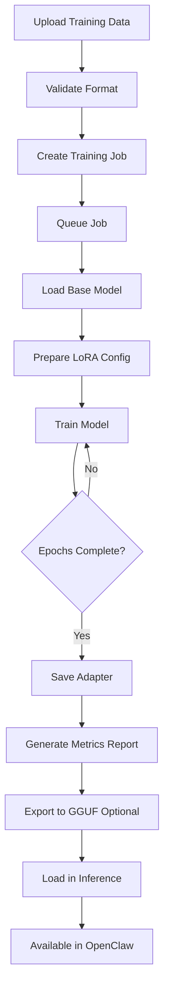

# LoRA Training Pipeline Architecture

## Overview

This document outlines the architecture for integrating LoRA (Low-Rank Adaptation) fine-tuning capabilities into Brain From Cero, enabling users to create personalized models for use with OpenClaw agents.

## Goals

1. **Enable model personalization** - Allow users to fine-tune models on custom data
2. **OpenClaw integration** - Export fine-tuned models as OpenAI-compatible endpoints
3. **Maintain inference performance** - Keep LoRA adapters separate from base models
4. **Simple workflow** - Provide easy-to-use API for training and deployment

## Architecture Components

### 1. Training Data Management

**Location**: `brain/training/data_manager.py`

**Responsibilities**:
- Validate training data format (JSONL with conversations)
- Store training datasets per agent
- Support data augmentation
- Track dataset versions

**Data Format**:
```jsonl
{"messages": [{"role": "system", "content": "..."}, {"role": "user", "content": "..."}, {"role": "assistant", "content": "..."}]}
{"messages": [{"role": "user", "content": "..."}, {"role": "assistant", "content": "..."}]}
```

**Storage Structure**:
```
data/
├── agents/
│   └── {agent_id}/
│       ├── training_data/
│       │   ├── dataset_v1.jsonl
│       │   └── dataset_v2.jsonl
│       └── adapters/
│           └── {adapter_name}/
│               ├── adapter_config.json
│               ├── adapter_model.safetensors
│               └── training_metadata.json
```

### 2. Training Engine

**Location**: `brain/training/trainer.py`

**Dependencies**:
- `torch` - PyTorch for model training
- `transformers` - Hugging Face transformers
- `peft` - Parameter-Efficient Fine-Tuning (LoRA implementation)
- `datasets` - Dataset handling
- `trl` - Transformer Reinforcement Learning (SFT Trainer)

**Key Classes**:

```python
class LoRATrainer:
    """Manages LoRA fine-tuning jobs"""

    async def start_training(
        self,
        agent_id: str,
        base_model: str,
        dataset_path: str,
        config: TrainingConfig
    ) -> TrainingJob

    async def get_training_status(self, job_id: str) -> TrainingStatus

    async def cancel_training(self, job_id: str)
```

**Training Configuration**:
```python
@dataclass
class TrainingConfig:
    # LoRA parameters
    lora_r: int = 16  # Rank
    lora_alpha: int = 32  # Scaling factor
    lora_dropout: float = 0.05
    target_modules: List[str] = ["q_proj", "v_proj", "k_proj", "o_proj"]

    # Training parameters
    num_epochs: int = 3
    batch_size: int = 4
    learning_rate: float = 2e-4
    warmup_steps: int = 100
    gradient_accumulation_steps: int = 4
    max_seq_length: int = 2048

    # Optimizer
    optimizer: str = "adamw_torch"
    weight_decay: float = 0.01
```

### 3. Training Job Manager

**Location**: `brain/training/job_manager.py`

**Responsibilities**:
- Queue and schedule training jobs
- Track training progress (loss, epochs, steps)
- Store training metrics and logs
- Handle job cancellation and cleanup

**Job States**:
- `queued` - Waiting to start
- `preparing` - Loading model and data
- `training` - Active training
- `evaluating` - Running validation
- `completed` - Successfully finished
- `failed` - Error occurred
- `cancelled` - User cancelled

### 4. LoRA Adapter Manager

**Location**: `brain/core/adapter_manager.py`

**Extends**: `ModelManager`

**Responsibilities**:
- Load LoRA adapters on top of base models
- Cache loaded adapters
- Manage adapter versions
- Unload adapters when not in use

**Key Methods**:
```python
class AdapterManager:
    async def load_adapter(
        self,
        base_model: str,
        adapter_path: str
    ) -> Llama

    async def unload_adapter(self, adapter_id: str)

    def list_adapters(self, agent_id: str) -> List[AdapterInfo]

    async def export_adapter_gguf(
        self,
        adapter_path: str,
        output_path: str,
        quantization: str = "q4_k_m"
    )
```

### 5. API Endpoints

**Location**: `brain/api/training.py`

**Endpoints**:

```python
# Upload training data
POST /v1/agents/{agent_id}/training/data
Content-Type: multipart/form-data
Body: {file: training_data.jsonl}

# Start training job
POST /v1/agents/{agent_id}/training/jobs
Body: {
    "base_model": "qwen2.5-3b-instruct",
    "dataset_name": "dataset_v1",
    "adapter_name": "custom_support_v1",
    "config": {...}
}

# Get training status
GET /v1/agents/{agent_id}/training/jobs/{job_id}
Response: {
    "job_id": "...",
    "status": "training",
    "progress": {
        "epoch": 2,
        "total_epochs": 3,
        "step": 450,
        "total_steps": 600,
        "loss": 0.345,
        "learning_rate": 0.0001
    }
}

# List training jobs
GET /v1/agents/{agent_id}/training/jobs

# Cancel training job
DELETE /v1/agents/{agent_id}/training/jobs/{job_id}

# List adapters
GET /v1/agents/{agent_id}/adapters

# Export adapter to GGUF
POST /v1/agents/{agent_id}/adapters/{adapter_name}/export
Body: {"quantization": "q4_k_m"}
```

### 6. Dashboard Integration

**Location**: `brain/dashboard/templates/index.html`

**New Tab**: "🎓 Training"

**Features**:
- Upload training data with validation
- Configure training parameters (simple + advanced modes)
- Start/stop training jobs
- Real-time training metrics (loss curve, epoch progress)
- Adapter management (list, export, delete)
- Model comparison (base vs fine-tuned)

### 7. OpenClaw Integration

**Configuration Guide**: `docs/OPENCLAW_INTEGRATION.md`

#### Step 1: Export Fine-Tuned Model

```bash
# Export adapter as quantized GGUF
curl -X POST http://localhost:8000/v1/agents/my-agent/adapters/custom_v1/export \
  -H "Content-Type: application/json" \
  -d '{"quantization": "q4_k_m"}'
```

#### Step 2: Configure OpenClaw Provider

Create `models.providers` config in OpenClaw:

```json
{
  "providers": [
    {
      "id": "brain-local",
      "name": "Brain From Cero (Local)",
      "baseUrl": "http://localhost:8000/v1",
      "apiKey": "optional-api-key",
      "models": [
        {
          "id": "brain/custom-support-v1",
          "name": "Custom Support Agent v1",
          "contextWindow": 32768,
          "maxTokens": 4096,
          "supportsTools": true,
          "supportsVision": false
        }
      ]
    }
  ]
}
```

#### Step 3: Use in OpenClaw Agent

```bash
# Create agent using custom model
openclaw agents create support-bot \
  --model brain/custom-support-v1 \
  --provider brain-local
```

## Training Workflow



## Data Flow

### Training Phase
```
User -> Dashboard -> API (/v1/agents/{id}/training/jobs)
  -> JobManager (queue job)
  -> Trainer (async background)
    -> Load base model (HF format)
    -> Apply LoRA config
    -> Train on dataset
    -> Save adapter
  -> Update job status
```

### Inference Phase
```
OpenClaw Agent Request -> Brain API (/v1/chat/completions)
  -> AdapterManager.load_adapter()
    -> ModelManager.load_model(base)
    -> Apply LoRA adapter
  -> Inference with adapted model
  -> Return response
```

## Technical Considerations

### 1. Model Format Conversion

**Challenge**: llama-cpp-python uses GGUF format, but LoRA training requires HuggingFace format

**Solution**:
- Maintain HuggingFace versions of base models for training
- Convert trained adapters to GGUF format for inference
- Use `llama.cpp` conversion tools: `convert-hf-to-gguf.py`

**Storage**:
```
data/models/
├── qwen2.5-3b-instruct/          # GGUF for inference
│   └── qwen2.5-3b-instruct-q4_k_m.gguf
└── qwen2.5-3b-instruct-hf/       # HF for training
    ├── config.json
    ├── tokenizer.json
    └── model.safetensors
```

### 2. GPU Memory Management

**Challenge**: Training requires significant GPU memory

**Solutions**:
- Use QLoRA (4-bit quantization) to reduce memory
- Gradient checkpointing for large models
- Batch size auto-tuning
- Only load training dependencies when needed

```python
# Lazy import to avoid loading torch unless training
def get_trainer():
    try:
        from brain.training.trainer import LoRATrainer
        return LoRATrainer()
    except ImportError:
        raise RuntimeError(
            "Training dependencies not installed. "
            "Install with: pip install brain[training]"
        )
```

### 3. Background Job Processing

**Challenge**: Training jobs run for hours

**Solution**: Use background tasks with proper process management

```python
# In training.py
@router.post("/agents/{agent_id}/training/jobs")
async def start_training_job(
    agent_id: str,
    request: TrainingRequest,
    background_tasks: BackgroundTasks
):
    job = await job_manager.create_job(agent_id, request)
    background_tasks.add_task(run_training, job.id)
    return job
```

### 4. Training Data Privacy

**Consideration**: Training data may contain sensitive information

**Measures**:
- Store training data per-agent (isolated)
- No cross-agent data sharing
- Optional encryption for datasets
- Audit logs for data access

## Dependencies Update

Add to `requirements.txt`:

```txt
# Training dependencies (optional)
# Install with: pip install brain[training]
torch>=2.2.0
transformers>=4.38.0
peft>=0.8.2
datasets>=2.16.1
trl>=0.7.10
bitsandbytes>=0.42.0  # For QLoRA
accelerate>=0.26.0     # For distributed training
```

Add to `setup.py`:

```python
extras_require={
    "training": [
        "torch>=2.2.0",
        "transformers>=4.38.0",
        "peft>=0.8.2",
        "datasets>=2.16.1",
        "trl>=0.7.10",
        "bitsandbytes>=0.42.0",
        "accelerate>=0.26.0",
    ]
}
```

## Performance Targets

- **Training Speed**: ~1000 tokens/sec on RTX 3090
- **Memory Usage**: <10GB VRAM for 3B model with QLoRA
- **Adapter Size**: ~20-50MB per adapter
- **Inference Overhead**: <5% latency increase vs base model

## Security Considerations

1. **API Authentication**: Add API key validation for training endpoints
2. **Resource Limits**: Max concurrent training jobs, max dataset size
3. **Sandboxing**: Run training in isolated environment
4. **Input Validation**: Strict validation of training data format

## Future Enhancements

1. **Multi-GPU Support**: Distributed training with DeepSpeed
2. **Model Merging**: Merge multiple adapters
3. **Continual Learning**: Update adapters with new data
4. **A/B Testing**: Compare adapter performance
5. **Auto-tuning**: Automatic hyperparameter optimization
6. **Evaluation Suite**: Standardized benchmarks for adapters

## References

- [PEFT Documentation](https://huggingface.co/docs/peft)
- [LoRA Paper](https://arxiv.org/abs/2106.09685)
- [QLoRA Paper](https://arxiv.org/abs/2305.14314)
- [OpenClaw Model Providers](https://docs.openclaw.ai/concepts/model-providers)
- [llama.cpp GGUF Format](https://github.com/ggerganov/llama.cpp/blob/master/gguf-py/README.md)

---

**Status**: Architecture design complete - Ready for implementation
**Next Steps**: Begin implementation of core training components
