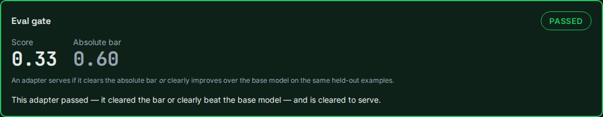
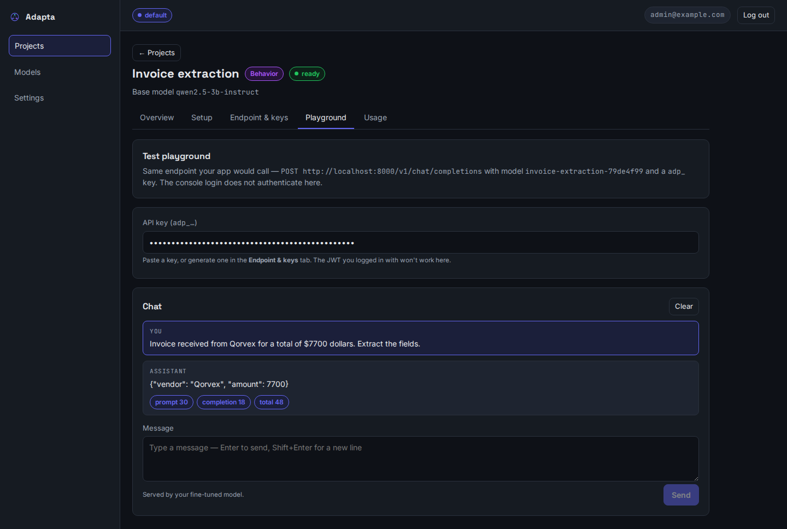
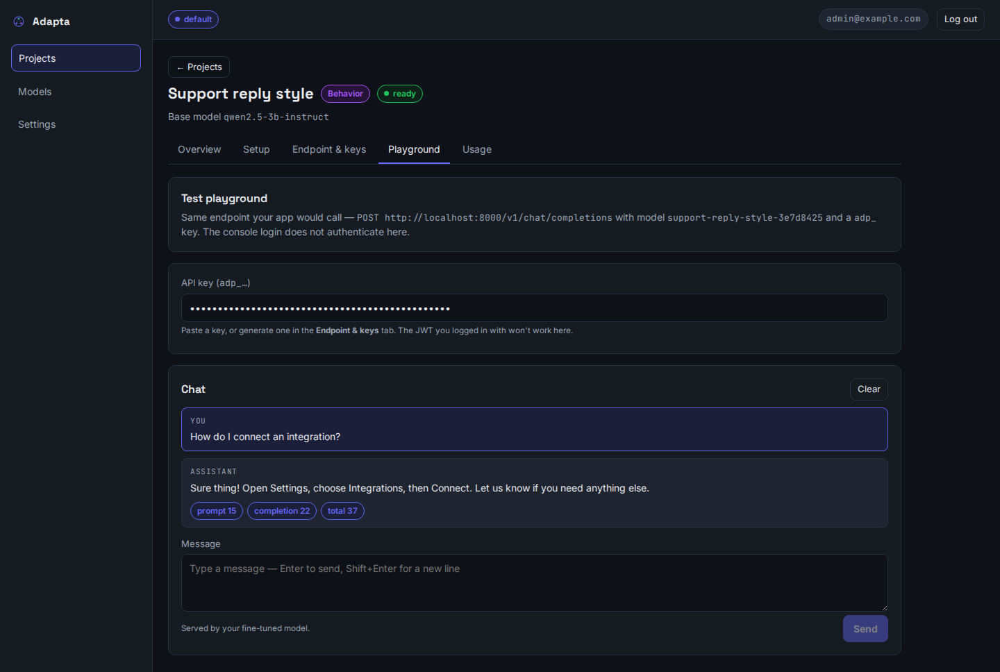

# Fine-tuning use cases — a validation record (real 3B runs)

This page registers a real, GPU-backed validation of the fine-tuning path on the
**default `qwen2.5-3b-instruct`** base — the model an operator actually ships. Every
result and screenshot below comes from training real QLoRA adapters on the worker,
scoring them on held-out data through the eval gate, and serving them from the console.
It is reproduced by the opt-in suite `tests/integration/test_lora_use_cases.py`.

## The matrix — what we trained and what happened

| Use case | What it learns | Gate result (3B) | Served on a held-out input |
|---|---|---|---|
| **Structured extraction** | text → a fixed JSON schema | ✅ pass — score 0.33, **+0.20** over base | `{"vendor": "Qorvex", "amount": 7700}` |
| **Classification / routing** | message → one label | ✅ pass — score **0.67** (absolute bar) | `technical` |
| **Fixed format / voice** | reply in the house template | ✅ pass — score 0.25, **+0.22** over base | "Sure thing! … Let us know if you need anything else." |
| **Knowledge + behavior** | RAG facts **+** brand voice, one endpoint | ✅ pass — **+0.34** over base | cites the doc (`LunaBeans2026`) **and** signs off in the trained voice |
| **Garbage (negative control)** | nothing — patternless data | ⛔ **blocked** — delta −0.002 | *(cannot serve — gate refused it)* |

The negative control matters as much as the passes: a dataset with no learnable pattern
**must not** clear the gate, and it doesn't. (An earlier control accidentally used a fixed
sentence template — which *is* a learnable pattern — and a capable 3B correctly learned it;
the fix was to make the control genuinely patternless, not to weaken the gate.)

## 1 · Structured extraction — invoice → JSON

The textbook fine-tune: teach the model to emit a fixed schema. The gate passes, and the
served endpoint returns clean JSON for an invoice it never trained on.





## 2 · Fixed format / house voice

Teach the assistant to answer in one consistent template. Note the model paraphrases the
opener ("Sure thing!") but keeps the learned house phrasing and the exact closer — the
*shape* is what it learned.




## 3 · Classification / routing

A support-ticket triage fine-tune (message → `billing` / `technical` / `account`). Full
walkthrough with screenshots: [Fine-tuning, proven](fine-tuning-walkthrough.md).

## 4 · Knowledge + behavior on one endpoint

The production pattern — RAG facts (cited) composed with a fine-tuned brand voice in a
single call. Full walkthrough: [Knowledge + behavior together](knowledge-and-behavior.md).

## Reproducing this — and a note on small GPUs

```bash
# Whole matrix on the 3B (opt-in; heavy — real QLoRA per scenario):
docker compose exec -e ADAPTA_RUN_LORA_USECASES=1 app \
  python -m pytest -m "integration and slow" tests/integration/test_lora_use_cases.py -s

# Faster, lower-VRAM floor run on the 0.5B:
docker compose exec -e ADAPTA_RUN_LORA_USECASES=1 -e ADAPTA_USECASE_BASE=Qwen/Qwen2.5-0.5B-Instruct \
  -e ADAPTA_USECASE_EPOCHS=25 app python -m pytest -m "integration and slow" \
  tests/integration/test_lora_use_cases.py -s
```

!!! note "Each case passes; the all-in-one 3B run is hardware-bound on an 8 GB card"
    Every scenario above passes on the 3B. Running **all five back-to-back in one process**
    on the dev host (8 GB RTX 3050, with the GPU reserved for training and inference served
    on CPU) is memory-bound: serving several distinct 3B models in sequence eventually
    exhausts host RAM and the server stops responding mid-suite. That's an environmental
    limit of this box, not the feature — on a roomier host (or the 0.5B floor run) the full
    suite completes in one pass. The eval gate itself was moved to a 4-bit base load so a 3B
    evaluation fits comfortably and runs fast.
