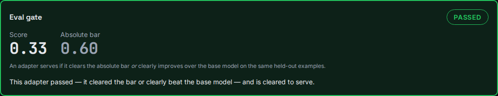
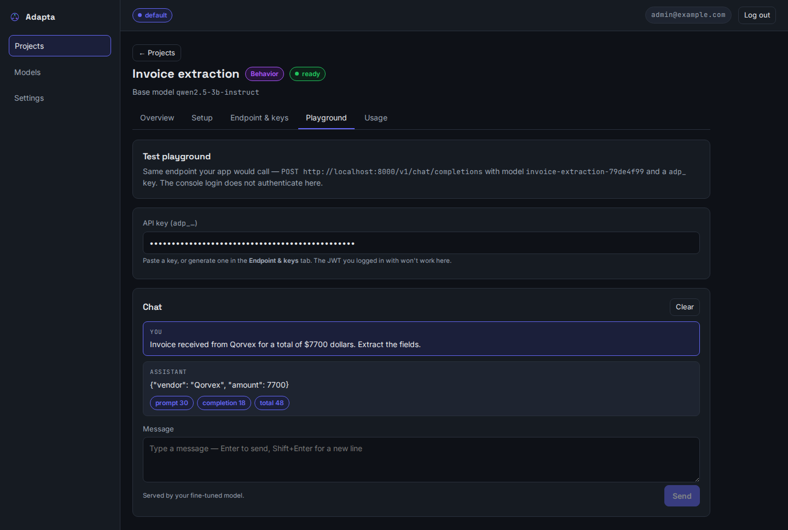
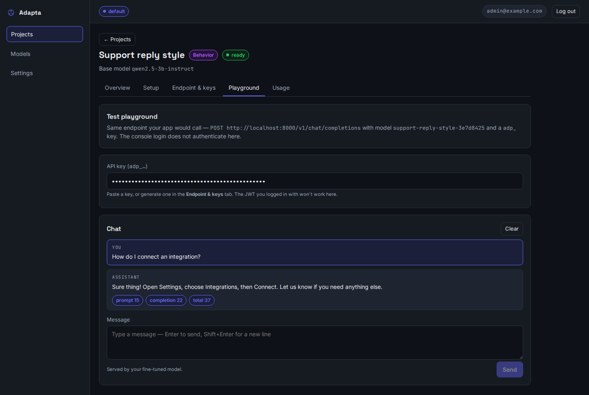

# Fine-tuning use cases — a validation record (real GPU runs)

This page registers a real, GPU-backed validation of the fine-tuning path. Every result
below comes from training real QLoRA adapters on the worker and scoring them on held-out
data through the eval gate. It is reproduced by the opt-in suite
`tests/integration/test_lora_use_cases.py`.

**Re-measured 2026-09-17 (§E1.3 + §E1.4)** on `qwen2.5-1.5b-instruct`, the Apache-licensed
default since §E1.2. The training loss is now response-only and training, evaluation and
serving all render the same ChatML prompt — before, text SFT trained on a prompt format the
endpoint never sent and spent gradient on the prompt tokens.

## The matrix — use cases trained and results

Base `Qwen/Qwen2.5-1.5B-Instruct`, 4-bit QLoRA, ~36 rows per scenario, 20 epochs, held-out
last 20 %. `score = exp(−avg held-out response-only loss)`; the gate passes on
`score ≥ 0.6` **or** (`score ≥ 0.05` **and** `score_delta ≥ 0.05`).

| Use case | What it learns | Gate result | Base | Delta |
|---|---|---|---|---|
| **Structured extraction** | text → a fixed JSON schema | ✅ pass — score **0.9997** | 0.2989 | **+0.7007** |
| **Classification / routing** | message → one label | ✅ pass — score **0.9949** | 0.7989 | **+0.1960** |
| **Fixed format / voice** | reply in the house template | ✅ pass — score **0.5290** (improvement path) | 0.0312 | **+0.4977** |
| **Knowledge + behavior** (3B) | RAG facts **+** brand voice, one endpoint | ✅ gate passed — score **0.2923** | 0.0010 | **+0.2913** |
| **Garbage (negative control)** | nothing — patternless data | ⛔ **blocked** — score 0.0022 | 0.0062 | **−0.0040** |

The single-path e2e (`test_lora_e2e.py`, `Qwen/Qwen2.5-0.5B-Instruct`) scored **1.0000** against
a base of 0.0409 (**+0.9591**) and served the learned answer through the endpoint.

!!! warning "Read these numbers honestly"
    **Two things changed at once.** The previous record measured the 3B base (extraction 0.33,
    classification 0.67, format 0.25); this one measures the 1.5B *and* includes the two
    correctness fixes. The jump cannot be attributed to the fixes alone — it is the combined
    effect, and the direction is what §E1.3/§E1.4 predicted.

    **A near-1.0 score is not a quality claim.** These datasets are small and deliberately
    patterned, so a correctly-trained adapter reproduces the held-out responses almost exactly
    and `exp(−loss)` saturates. The score measures held-out response likelihood, not whether
    the JSON parses or the label is right — task metrics are §E4.1.

    **The combined scenario passed the gate but its test failed at the serving step** on the
    8 GB box used for this run: the endpoint and key were created, then five attempts to serve
    the 3B GGUF timed out under memory pressure right after training. That is the
    serving-density limit described at the bottom of this page, not a training or gate failure.

The negative control matters as much as the passes: a dataset with no learnable pattern
**must not** clear the gate, and it doesn't — it scored 0.0022 against a base of 0.0062, a
*negative* delta. (An earlier control accidentally used a fixed sentence template — which *is*
a learnable pattern — and a capable 3B correctly learned it; the fix was to make the control
genuinely patternless, not to weaken the gate.)

## 1 · Structured extraction — invoice → JSON

The textbook fine-tune: teach the model to emit a fixed schema. The gate passes, and the
served endpoint returns clean JSON for an invoice it never trained on.





## 2 · Fixed format / house voice

Teach the assistant to answer in one consistent template. Note the model paraphrases the
opener ("Sure thing!") but keeps the learned house phrasing and the exact closer — the
*shape* is what it learned.




## 3 · Classification / routing

A support-ticket triage fine-tune (message → `billing` / `technical` / `account`). Full
walkthrough with screenshots: [Fine-tuning, proven](fine-tuning-walkthrough.md).

## 4 · Knowledge + behavior on one endpoint

The production pattern — RAG facts (cited) composed with a fine-tuned brand voice in a
single call. Full walkthrough: [Knowledge + behavior together](knowledge-and-behavior.md).

## Reproducing this — and a note on small GPUs

```bash
# Whole matrix on the current default 1.5B (opt-in; heavy — real QLoRA per scenario). Cap the
# serving cache to ONE resident model so back-to-back serving of distinct fine-tunes can't pile up:
docker compose exec -e ADAPTA_RUN_LORA_USECASES=1 -e ADAPTA_MAX_LOADED_MODELS=1 \
  -e ADAPTA_USECASE_BASE=Qwen/Qwen2.5-1.5B-Instruct app \
  python -m pytest -m "integration and slow" tests/integration/test_lora_use_cases.py -s

# Faster, lower-VRAM floor run on the 0.5B:
docker compose exec -e ADAPTA_RUN_LORA_USECASES=1 -e ADAPTA_USECASE_BASE=Qwen/Qwen2.5-0.5B-Instruct \
  -e ADAPTA_USECASE_EPOCHS=25 app python -m pytest -m "integration and slow" \
  tests/integration/test_lora_use_cases.py -s
```

!!! note "Serving cache size matters when one host serves many large fine-tunes"
    On the 2026-09-17 re-measure (1.5B, `ADAPTA_MAX_LOADED_MODELS=1`, an 8 GB RTX 3050) the
    four gate scenarios passed back to back and the combined scenario cleared the gate but
    could not serve — its 3B GGUF timed out loading right after training. An earlier 3B run
    had all five green. The catch: the serving cache keeps up to
    `ADAPTA_MAX_LOADED_MODELS` (default **2**) distinct models resident, and on a host that
    serves inference on **CPU** (the GPU is reserved for training), holding two large 3B
    fine-tunes at once and loading a third mid-suite made the server stop responding. Setting
    **`ADAPTA_MAX_LOADED_MODELS=1`** (now a compose passthrough) keeps one model resident at a
    time — that's the minimum for a single box that both trains and serves several large
    adapters, and on an 8 GB card serving a 3B immediately after a training run can still time
    out. Give the box more VRAM, or keep the serving base at 1.5B, if you need both at once. Separately, the eval gate loads
    its base in **4-bit**, so a 3B evaluation fits comfortably on an 8 GB card and runs fast.
