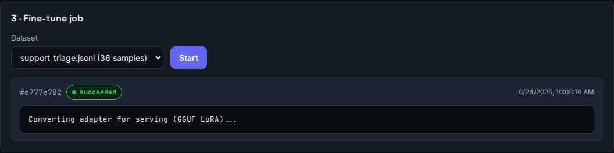

# Fine-tuning, proven — a real run end to end

This page is **not** a mock-up. Every screenshot below comes from a real fine-tune
that trained on a GPU, was scored on examples it never saw, passed the quality
gate, and then served live answers — captured straight from the operator console.

**The task:** route inbound support tickets into one of three buckets —
`billing`, `technical`, or `account`. A small, concrete *behavior*: read a
message, reply with one label. Exactly what fine-tuning is good at (and what a
generic model does poorly out of the box).

!!! info "What you're looking at"
    Base model **qwen2.5-0.5b-instruct** (the smallest in the catalog), trained on
    **36 real example tickets**. If even the smallest model clears the gate on this,
    a larger one clears it by more. This is the floor, not the ceiling.

---

## The whole pipeline at a glance

Dataset → training job → **eval gate** → serving. One project, four steps, all green:

The platform never calls this "training" in the textbook sense — the console frames
it as *"change how your model behaves."* Below we walk the steps that matter.

---

## 1 · The dataset and the training job

A dataset is just example pairs: an input (the ticket) and the ideal output (the
label). 36 of them, uploaded as a `.jsonl` file. The job then runs **QLoRA** on the
GPU — it produces a small *adapter* (a few MB) that layers on top of the base model
without changing it.

The job is green — **succeeded**. But "the training finished" is not the same as
"the result is good." That's what the next step decides.

---

## 2 · The eval gate — the part that matters

Before an adapter is ever allowed to serve, it sits an exam on examples **held out**
from training (the model never saw them). This is the platform's core safety
guarantee: an unproven fine-tune cannot go live.

Reading this card in plain terms:

- **Score 0.67** — how well the adapter produced the right label on the held-out
  tickets. Higher is better; `1.0` would be perfect.
- **Absolute bar 0.60** — a high bar meaning "strong on its own." This run cleared
  it (0.67 ≥ 0.60).
- There's also a second way to pass — **beating the base model** by a clear margin
  on the same held-out tickets (here it also did: **+0.099 over base**). Either path
  earns a **PASSED**. A fine-tune that learned nothing useful clears neither and is
  **blocked** — it simply cannot be served.

This is the honest signal. It is not a participation trophy: in our test suite, a
deliberately patternless dataset is correctly **rejected** by this same gate.

---

## 3 · It becomes a live, OpenAI-compatible endpoint

Because the gate passed, the project can mint a serving endpoint — a normal
OpenAI-style API. Point any OpenAI client at it, use the slug as the model, and
authenticate with a scoped `adp_` key.

Notice the header: **`qwen2.5-0.5b-instruct + fine-tuned adapter · eval 0.669 ·
passed via improvement`**. The endpoint is the base model *plus* the proven adapter,
nothing hand-wired.

---

## 4 · The proof: it actually answers with what it learned

The console **Playground** calls that exact endpoint. We send a ticket the model
never trained on:

> *My card was declined but I was still charged — what happened?*

The answer is a single word: **`billing`**. The un-adapted base model, given the same
prompt, rambles a paragraph of guesses (we measured that too — it's why the
*improvement* over base is real). The fine-tune learned to do one job and do it
cleanly.

---

## What this run demonstrates

- **The pipeline is real and complete** — upload, train on GPU, score on held-out
  data, gate, convert, serve. No step is faked.
- **The gate works in both directions** — it passed a genuinely useful adapter and
  (in the test suite) blocks a useless one.
- **Fine-tuning shines on a bounded behavior** — classification here; the same holds
  for structured extraction (text → fixed JSON) and fixed format/voice. For *facts*,
  use [Knowledge (RAG)](knowledge-and-behavior.md) instead — and you can combine both
  on one endpoint.

!!! note "Reproduce it yourself"
    The viability of each use case is pinned by an automated, GPU-backed test:
    `tests/integration/test_lora_use_cases.py` (run with `ADAPTA_RUN_LORA_USECASES=1`).
    It trains extraction, classification and format adapters, asserts each clears the
    gate, and asserts an unlearnable control dataset is blocked.
