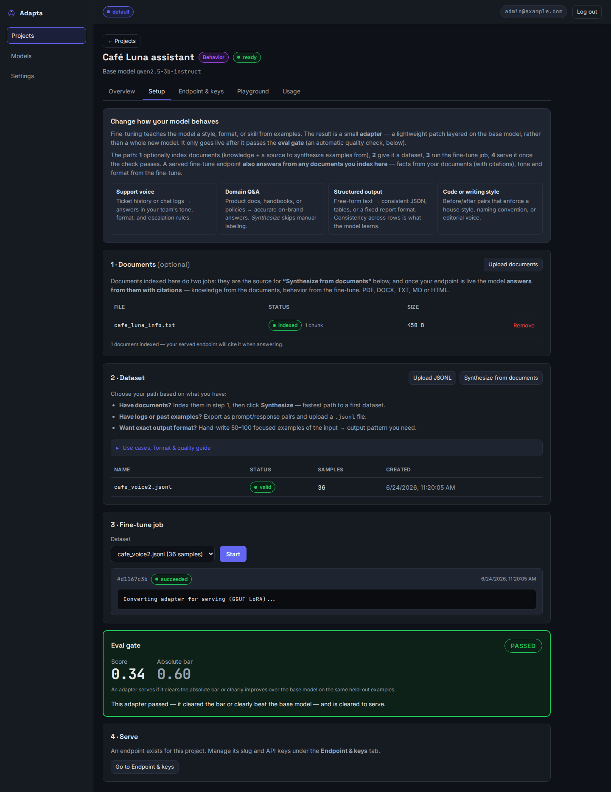
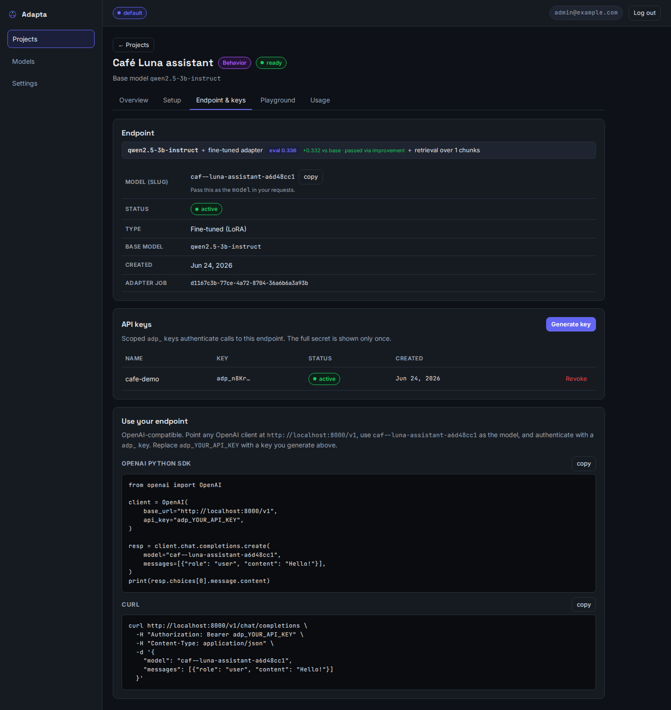
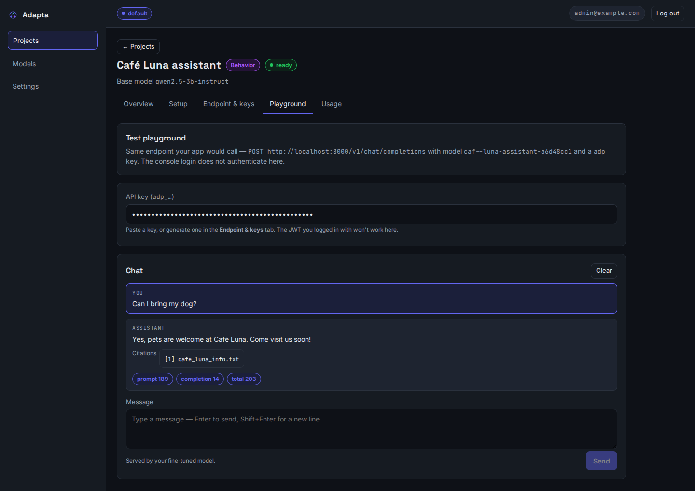

# Knowledge + behavior — using RAG and fine-tuning together

The two services answer two different questions:

- **Knowledge (RAG)** changes **what the model can talk about** — it answers
  *from your documents*, with citations. No weights change.
- **Fine-tuning (LoRA)** changes **how the model behaves** — its tone, its
  output structure, a narrow skill. It does **not** reliably add facts.

The strongest production pattern uses **both on one endpoint**: retrieval
supplies the facts, the adapter makes the answer come out in *your* voice and
*your* format. This page explains when to use which, and walks one realistic
example end to end.

## When to use which — real-life cases

| Your situation | Use | Why |
|---|---|---|
| "Answer questions about our 400-page product manuals" | **Knowledge** | The facts live in documents; they change when the docs change — re-index, done. |
| "Our internal wiki updates weekly and answers must cite the source" | **Knowledge** | RAG citations point at the exact passage; updates are instant. |
| "Support replies must always follow our 5-part template and sound like us" | **Fine-tuning** | A format/voice is a *behavior* — it lives in weights, not in any document. |
| "Classify incoming tickets into our 12 internal categories" | **Fine-tuning** | A narrow skill with your private taxonomy; small local models learn it well from examples. |
| "Always answer in strict JSON our backend parses" | **Fine-tuning** | Prompting drifts; a fine-tune makes the structure near-deterministic. |
| "A support assistant that answers **from our manuals**, **in our voice and template**" | **Both** | Facts from retrieval (cited), form from the adapter. |

!!! warning "What fine-tuning is *not* for"
    Don't fine-tune to teach the model facts ("memorize our price list").
    Facts belong in documents the model retrieves — they stay current and come
    back cited. A fine-tune that tries to memorize facts is brittle and goes
    stale on the first product change. Rule of thumb: **facts → Knowledge,
    form → Fine-tuning.**

## How the combination works

A project of type **fine-tune** can *also* index documents (console: the
**Documents** step of the fine-tune flow; API: the same
`POST /v1/projects/{id}/files` used by RAG projects). At serve time the
endpoint composes whatever the project has:

- documents indexed → relevant passages are retrieved and injected, and the
  response carries `citations`;
- an eval-passed adapter → it is applied on top of the base model.

A fine-tune project with indexed documents gets **both in the same call**.
(A pure-RAG project and a documents-free fine-tune project behave exactly as
before.) Bonus: those same indexed documents are what
`POST …/datasets/synthesize` reads when you bootstrap a dataset from documents.

## Worked example — a support assistant for "Nordwind Appliances"

Nordwind sells industrial coffee machines. They want an assistant that:

1. answers **from the official service manuals** (facts → documents),
2. always replies in the house template — *acknowledge → likely cause →
   numbered steps → safety note → sign-off* — in a calm, no-marketing tone
   (form → fine-tune).

Everything below also works through the console (the fine-tune flow is the
same four steps); the API calls are shown so you can script it.

### 1 · Log in and create one fine-tune project

```bash
TOKEN=$(curl -s localhost:8000/v1/auth/login \
  -H 'Content-Type: application/json' \
  -d '{"email": "admin@example.com", "password": "admin12345"}' | jq -r .access_token)

TEAM_ID=$(curl -s localhost:8000/v1/auth/me -H "Authorization: Bearer $TOKEN" \
  | jq -r '.teams[0].team_id')

PROJECT_ID=$(curl -s localhost:8000/v1/projects \
  -H "Authorization: Bearer $TOKEN" -H 'Content-Type: application/json' \
  -d "{\"name\": \"Support assistant\", \"type\": \"finetune\",
       \"base_model\": \"qwen2.5-3b-instruct\", \"team_id\": \"$TEAM_ID\"}" | jq -r .id)
```

One project, type `finetune` — it will hold the documents *and* the adapter.

### 2 · Give it knowledge: upload the manuals

```bash
curl -s localhost:8000/v1/projects/$PROJECT_ID/files \
  -H "Authorization: Bearer $TOKEN" \
  -F file=@espressomat-9000-service-manual.pdf
```

Upload each manual (PDF, DOCX, TXT, MD, HTML). Indexing runs in the
background; `GET …/files` shows `indexed` with a chunk count when done.

### 3 · Teach it the behavior: the dataset

The dataset teaches the *template and tone*, *not* the facts — the facts will
come from retrieval at serve time. Write (or export from your ticket system)
prompt/response pairs where every response follows the house template:

```json
{"prompt": "The grinder makes a loud rattling noise.", "response": "Thanks for flagging this — a rattling grinder is worth stopping for.\n\nLikely cause: a foreign object (often a stray bean stone) in the burr chamber.\n\nSteps:\n1. Power the machine off and unplug it.\n2. Remove the hopper and empty the burr chamber.\n3. Inspect the burrs for debris and wear.\n4. Refit and run a 10 g test grind.\n\nSafety note: never open the burr chamber while the machine is plugged in.\n\n— Nordwind Support", "system": "You are Nordwind Appliances support. Always answer with: acknowledgment, likely cause, numbered steps, a safety note, and the team sign-off."}
```

Aim for **50–500 pairs, one consistent template throughout** — the model
learns the *pattern*. At least 10 valid rows are required (the last ~20% is
held out to score the result and never trained on). Upload it:

```bash
curl -s localhost:8000/v1/projects/$PROJECT_ID/datasets \
  -H "Authorization: Bearer $TOKEN" -F file=@support-style.jsonl
```

!!! tip "Bootstrapping from the manuals"
    `POST /v1/projects/{id}/datasets/synthesize` drafts Q/A pairs from the
    documents you indexed in step 2 — a fast start, but it produces *generic*
    Q/A. For a tone/template fine-tune, reshape the synthesized answers into
    your template (or hand-write the gold examples) before training: the model
    copies what it sees.

### 4 · Train, pass the gate, serve

```bash
JOB_ID=$(curl -s localhost:8000/v1/projects/$PROJECT_ID/jobs \
  -H "Authorization: Bearer $TOKEN" -H 'Content-Type: application/json' \
  -d "{\"dataset_id\": \"$DATASET_ID\"}" | jq -r .id)

# poll until succeeded; eval_passed must be true
curl -s localhost:8000/v1/projects/$PROJECT_ID/jobs/$JOB_ID -H "Authorization: Bearer $TOKEN"
```

The job trains a LoRA adapter on the GPU worker and scores it on held-out
examples. It may serve only if it clears the absolute score bar **or** clearly
improves over the base model on the same held-out split — an unverified
fine-tune never goes live. Then:

```bash
SLUG=$(curl -s -X POST localhost:8000/v1/projects/$PROJECT_ID/endpoint \
  -H "Authorization: Bearer $TOKEN" | jq -r .slug)

KEY=$(curl -s localhost:8000/v1/projects/$PROJECT_ID/keys \
  -H "Authorization: Bearer $TOKEN" -H 'Content-Type: application/json' \
  -d '{"name": "support-app"}' | jq -r .key)   # brn_… — shown once
```

### 5 · Call it — facts and form in one answer

Any OpenAI client works:

```python
from openai import OpenAI

client = OpenAI(base_url="http://localhost:8000/v1", api_key=KEY)

r = client.chat.completions.create(
    model=SLUG,  # the endpoint slug from step 4
    messages=[{"role": "user",
               "content": "The Espressomat 9000 shows error E-42, what do I do?"}],
)
print(r.choices[0].message.content)
```

What happens inside the one call: the question is embedded, the most relevant
manual passages are retrieved and injected (**knowledge**), and the adapter
shapes the reply into the acknowledged → cause → steps → safety → sign-off
template (**behavior**). The raw HTTP response also carries `citations`
pointing at the manual passages used, so your app can show "source: service
manual §4.2".

## See it working — one endpoint, knowledge + behavior

These screenshots are from a **real** run, not a mock-up: a corner coffee-shop
assistant, **Café Luna**. One fine-tune project holds *both* an indexed info
sheet (the café's hours, Wi-Fi, loyalty program → **knowledge**) and a fine-tune
trained on the café's friendly brand voice (**behavior**), trained on the GPU and
gated before serving.

**One project, both inputs** — a document indexed *and* an adapter that passed the
eval gate:



The endpoint header spells out the composition in one line —
**`base + fine-tuned adapter · eval 0.336 · passed via improvement + retrieval over 1 chunks`**:



**The payoff** — we ask the Playground *"Can I bring my dog?"* and get one answer
that is grounded in the document **and** in the trained voice:



The fact (*pets are welcome*) is pulled from the indexed sheet — note the
**`[1] cafe_luna_info.txt`** citation — while the **"Come visit us soon!"**
sign-off is the fine-tune. Facts from retrieval, voice from the adapter, one call.

!!! note "A real composition nuance — how RAG and voice share an answer"
    When documents are retrieved, the endpoint adds an instruction to *answer from
    the context and cite sources*. On smaller base models, a very **rigid** style
    signature (a fixed multi-sentence template) can get muted by that
    instruction on pure fact-lookup questions ("what's the Wi-Fi password?" → a
    terse, cited fact). The brand **voice still comes through** on the
    conversational questions that make up most real traffic — as above — and
    larger base models hold the voice more consistently. Practical guidance:
    keep the fine-tuned signature **short and distinctive** (a greeting or
    sign-off), lean on **3B+** bases for voice-heavy assistants, and remember the
    division of labor — **facts are RAG's job, tone is the fine-tune's**.

## Image understanding — vision fine-tunes

A project on a **vision base model** (`qwen2.5-vl-3b-instruct` in the catalog)
fine-tunes on **image + prompt → response** examples and serves an endpoint
that accepts images. It teaches the model to read *your* images in *your*
output format. Image **understanding** only — the platform never generates
images.

Real-life cases:

| Your situation | Why a vision fine-tune |
|---|---|
| "Extract vendor, date and totals from our scanned invoices into our JSON schema" | A generic VLM doesn't know your layouts or schema; 50–300 labeled examples teach both. |
| "Classify product photos against our internal defect taxonomy" | Your categories are private; the model learns them from examples — on your hardware. |
| "Read handwritten intake forms into structured fields" | Exactly the documents privacy-bound teams refuse to send to cloud APIs. |

### Dataset — a zip bundle

Images can't live in a JSONL line, so a vision dataset is a **`.zip` bundle**:
your images plus one manifest at the root. Each row points at its image by
bundle-relative path:

```text
invoices.zip
├── data.jsonl
└── images/
    ├── invoice_001.png
    └── invoice_002.jpg
```

```json
{"prompt": "Extract vendor, date and total as JSON.", "response": "{\"vendor\": \"Acme GmbH\", \"date\": \"2026-05-02\", \"total\": \"412.50\"}", "images": ["images/invoice_001.png"]}
```

`prompt`/`response` as in text datasets; `images` is required with **exactly
one** bundle-relative path (png, jpg, jpeg or webp; ≤ 10 MB and ≤ 8192 px per
image; ≤ 500 MB uncompressed and ≤ 2000 files per bundle). Upload it to the
same endpoint (`POST …/datasets`, or the fine-tune flow in the console) — the
server extracts, validates every row *and* every image, and reports
`modality: "vision"` with an image count. Training, the eval gate, and adapter
conversion then run exactly like a text fine-tune: held-out rows score the
adapter on images it never trained on, and an unverified adapter never serves.

### Calling a vision endpoint

Send OpenAI image content-parts with the image **inline as a data URL** (the
server never fetches remote image URLs):

```python
import base64
from openai import OpenAI

client = OpenAI(base_url="http://localhost:8000/v1", api_key=KEY)

with open("invoice_huber_may.png", "rb") as f:
    data_url = "data:image/png;base64," + base64.b64encode(f.read()).decode()

r = client.chat.completions.create(
    model=SLUG,  # a vision endpoint's slug
    messages=[{"role": "user", "content": [
        {"type": "image_url", "image_url": {"url": data_url}},
        {"type": "text", "text": "Extract vendor, date and total as JSON."},
    ]}],
)
print(r.choices[0].message.content)
# {"vendor": "Huber & Söhne KG", "date": "2026-05-17", "total": "1,284.00"}
```

v1 limits, by design: requests with images are non-streaming (`stream: false`),
up to 4 images per request, and skip document retrieval (text-only requests on
the same endpoint still answer from indexed documents with citations). Sending
an image to a *text* endpoint returns a clear 400 — create the project on a
vision base instead.

## Realistic expectations

- **Knowledge is live**: add or remove a manual and re-index — the very next
  answer reflects it. No retraining.
- **Behavior is trained**: changing the template means a new dataset + a new
  job (minutes to hours on the GPU, depending on base model and dataset size).
- The adapter only ever changes *how* answers read. If an answer's *facts* are
  wrong, fix the documents or their chunking — not the dataset.
- Start with the default `qwen2.5-3b-instruct` base; move up to
  `qwen2.5-7b-instruct` if quality demands it and your GPU allows
  (`GET /v1/projects` validates the catalog names for you).
