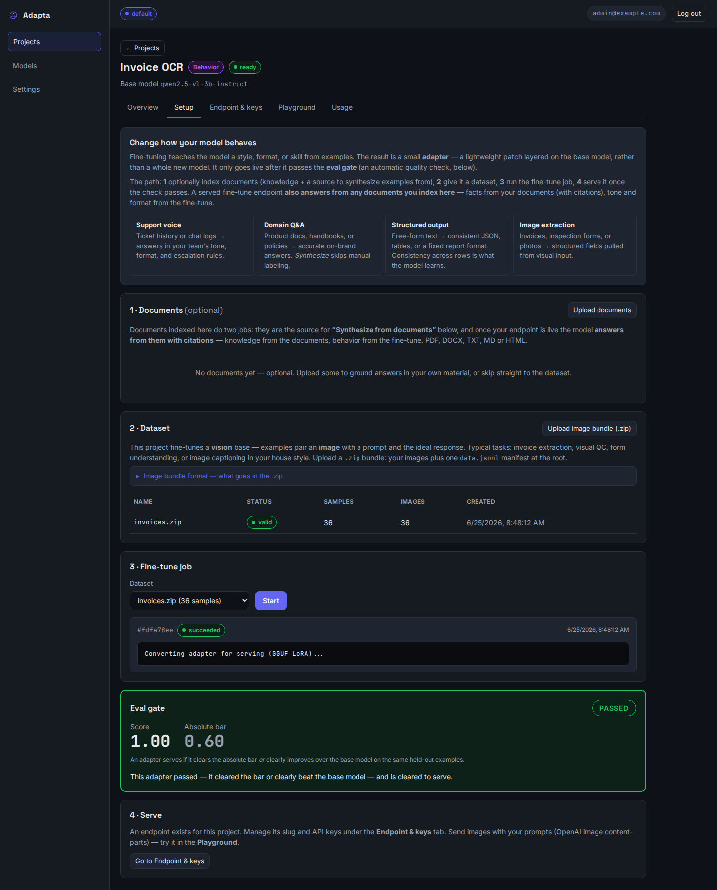
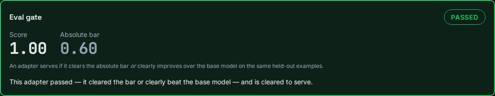
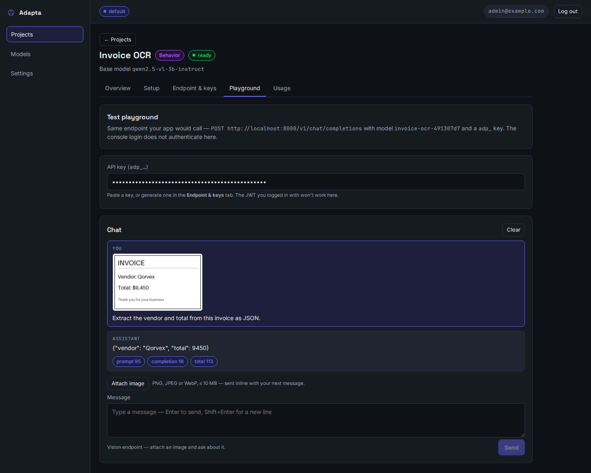

# Image understanding (OCR) — a vision fine-tune, proven

Adapta can fine-tune a **vision** model to read your images and answer in your format.
This page registers a real, GPU-backed run of that path on the
`qwen2.5-vl-3b-instruct` base — an **invoice OCR** fine-tune: it reads an invoice
*image* and extracts the vendor and total as JSON. Everything below is from real
training and serving, captured from the console.

!!! info "How a vision fine-tune divides the work"
    The base Qwen2.5-VL model already **reads text in images** (OCR is built in). The
    fine-tune doesn't teach it to read — it teaches it to answer in **your fixed shape**
    (here, `{"vendor": …, "total": …}`). Same idea as the text *structured extraction*
    case, but the input is a picture. Image **understanding** only — never image generation.

## What this run trained

| | |
|---|---|
| Base model | `qwen2.5-vl-3b-instruct` (vision) |
| Dataset | a **`.zip` image bundle** — 36 invoice images + a `data.jsonl` manifest |
| Each row | an invoice image → `{"vendor": "Qorvex", "total": 7700}` |
| Eval gate | ✅ **PASSED — score 1.00** (held-out invoices the model never trained on) |
| Served | a brand-new invoice image → `{"vendor": "Qorvex", "total": 9450}` |

## 1 · Upload the image bundle, train, pass the gate

A vision dataset is a `.zip`: your images plus one `data.jsonl` manifest whose rows
point at each image by bundle-relative path. The console takes the bundle, validates
every image, trains the VLM LoRA (vision tower frozen), and scores it on held-out rows.





## 2 · Serve it — attach an invoice image, get JSON

The endpoint accepts OpenAI image content-parts. In the console Playground we attach an
invoice the model never saw and ask for the fields — it reads the picture and returns the
trained JSON.



The invoice in the screenshot reads *Vendor: Qorvex / Total: $9,450* — and the served
answer is exactly `{"vendor": "Qorvex", "total": 9450}`. The model read the image (OCR)
**and** emitted the shape the fine-tune taught it.

## Bundle format and calling the endpoint

```text
invoices.zip
├── data.jsonl          ← one manifest at the root
└── images/
    ├── invoice_00.png
    └── invoice_01.png
```

```json
{"prompt": "Extract the vendor and total from this invoice as JSON.", "response": "{\"vendor\": \"Qorvex\", \"total\": 7700}", "images": ["images/invoice_00.png"]}
```

Call it like any OpenAI vision endpoint — the image goes **inline as a data URL** (the
server never fetches remote image URLs):

```python
import base64
from openai import OpenAI

client = OpenAI(base_url="http://localhost:8000/v1", api_key=KEY)  # an adp_… key
data_url = "data:image/png;base64," + base64.b64encode(open("invoice.png", "rb").read()).decode()

r = client.chat.completions.create(
    model=SLUG,
    messages=[{"role": "user", "content": [
        {"type": "image_url", "image_url": {"url": data_url}},
        {"type": "text", "text": "Extract the vendor and total from this invoice as JSON."},
    ]}],
)
print(r.choices[0].message.content)   # {"vendor": "Qorvex", "total": 9450}
```

## When a bundle has bad images

Real bundles are messy — a manifest can reference an image that didn't make it into
the zip, a scan can be corrupt, or one file can exceed the size/dimension caps. The
console validates **every** referenced image and reports **all** problems in one pass
(up to 25, then `… and N more`), so you fix a large bundle in a single round instead
of discovering issues one re-upload at a time. The dataset shows `invalid` with a
report like:

```text
Found 3 problem(s) in the dataset:
  • Line 12: image 'images/invoice_11.png' not found in the bundle
  • Line 27: image 'images/invoice_26.png' cannot be decoded
  • Line 40: image 'images/invoice_39.png' is 9000x6000; the longest side may be at most 8192px
Fix these and re-upload.
```

Nothing is trained until the bundle is fully valid — a single bad row keeps the
whole dataset `invalid`, so a broken image can never silently degrade a fine-tune.

## Reproducing this

The automated smoke test trains a VLM LoRA, gates it on held-out images, converts it to
GGUF, and serves an image request — verified green (`1 passed`):

```bash
docker compose exec -e ADAPTA_RUN_VLM_E2E=1 app \
  python -m pytest -m "integration and slow" tests/integration/test_vlm_lora_e2e.py -s
```

!!! note "v1 limits and a serving note"
    Image requests are **data-URL only**, **non-streaming**, up to 4 images per request,
    and skip document retrieval (no RAG composition with image input). Serving a VLM is
    heavier than text: the first image request loads the base GGUF **plus** the `mmproj`
    vision projector, and on a host that serves inference on **CPU** that cold load is
    slow — keep `ADAPTA_MAX_LOADED_MODELS` modest when several vision endpoints share one
    box. The first run of the smoke test also downloads the ~7 GB VL base.
